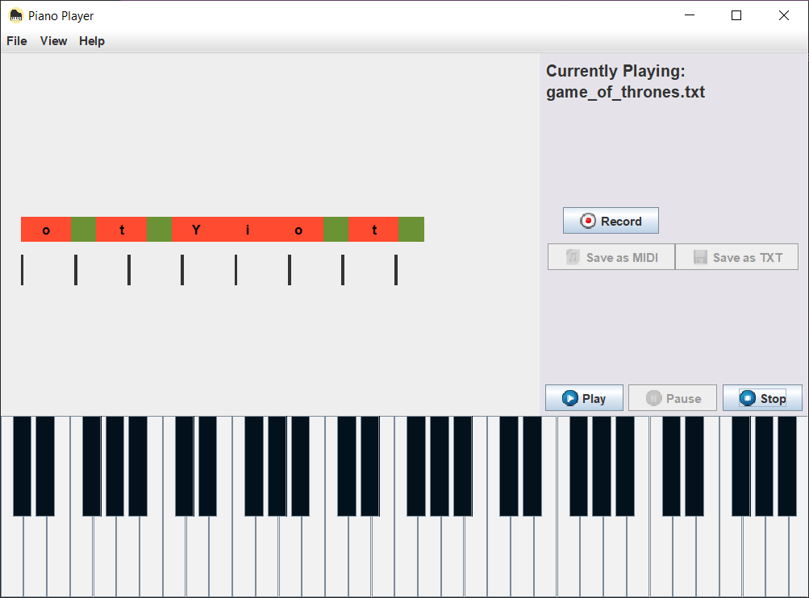
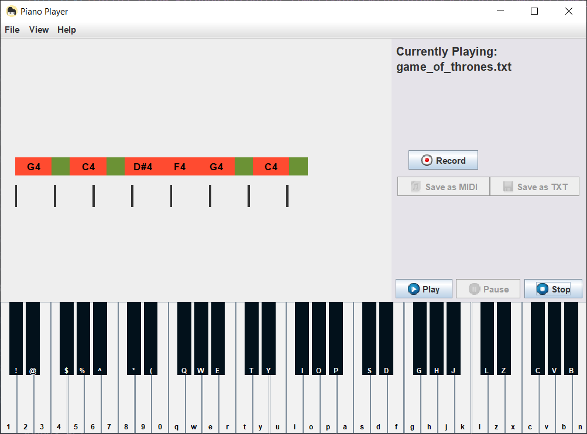

# Project Description
The goal of the PianoPlayer project was to create a fully functioning piano player in Java, that has the following features:
1. Can load-in note data from a .CSV (key -> midiNum mapping)
2. Can load-in composition data from VirtualPiano (www.virtualpiano.net)
3. Display the composition in the window
4. Play the loaded composition (playback, with a stop / pause / record)
5. Use the keyboard or mouse to play the piano
6. Export the recorded composition as a .TXT (VirutalPiano format) or .MIDI

# The GUI
The following pictures encapsulate the program's capabilities:
### Initial state

### KeyAssist toggled

### Display notes instead of keys

# Program Breakdown
## Data input
The note data (contained in the file map.csv) is used to map a specific keyboard key to a Note / Octave, as well as a unique MIDI number (later used in exporting). This is how the program knows which note to play through the Java Sounds API.

The VirtualPiano data is loaded in via a regular text file. With a combination of Java Streams, and a couple of Regex expressions, the program is able to quickly create multiple maps which are used later by different classes. Each note is given a unique number indicating its position within the sequence. The sequence is sorted using this number, thus creating the final composition.
### Types of VirtualPiano symbols
1. Blank character -> Pause with a duration of 1/8
2. | -> Pause with a duration of 1/4
3. [abc] (notes within square brackets) -> Notes that should be played together (a chord), with a duration of 1/4
4. [a b c] (space in square brackets) -> Notes that should be played separately, with a duration of 1/8
5. Characters outside of brackets -> Notes that should be played with a duration of 1/4

# Video demonstration of PianoPlayer
The best way to truly understand how it works is to actually use it. Below is a video demonstrating some of its capabilities.
